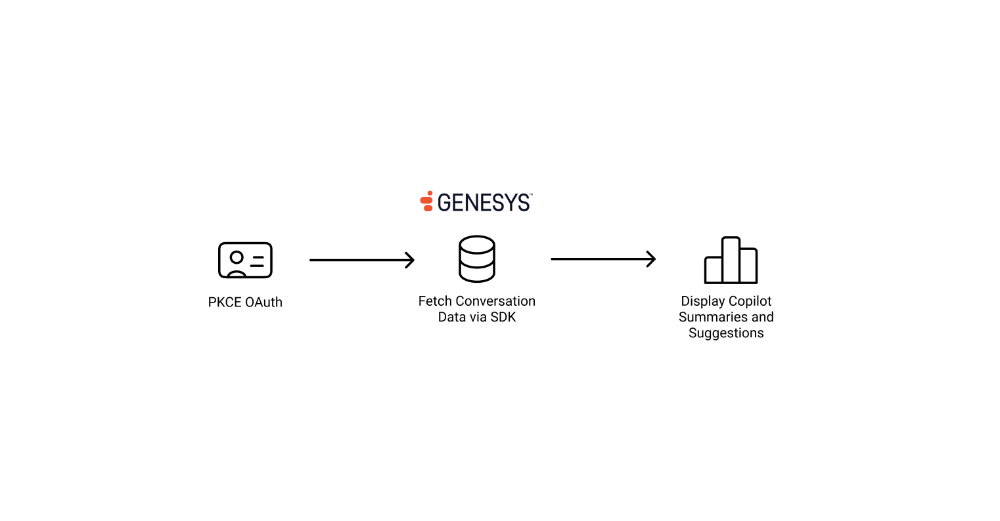
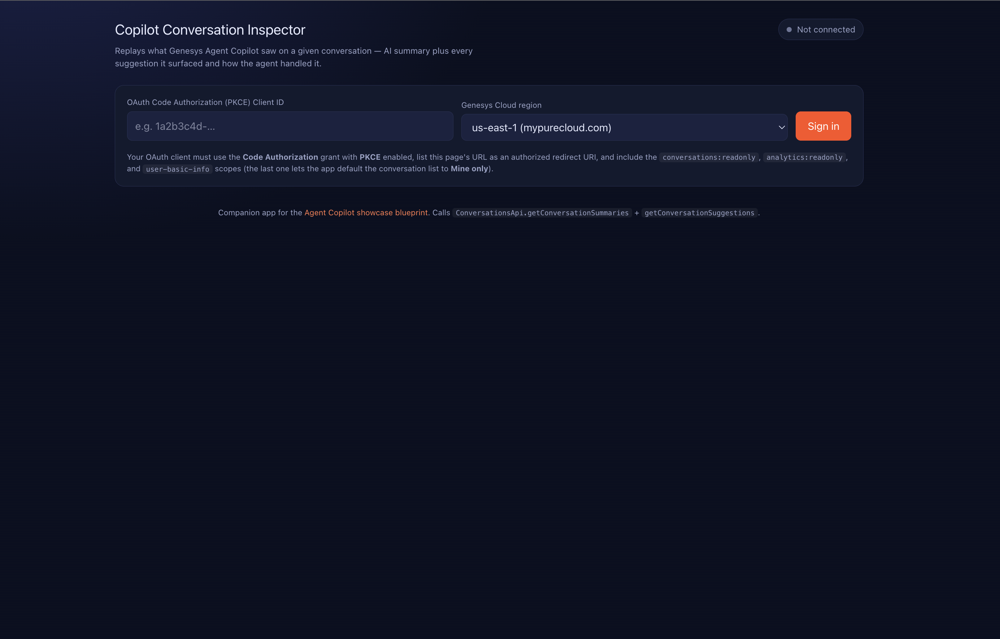

This Genesys Cloud Developer Blueprint provides a working single-page web application, the **Copilot Conversation Inspector**, that replays what Genesys Agent Copilot did on a given conversation. Clone the repository, create one OAuth client in Genesys Cloud, run two `npm` commands, and you have a browser-based UI for reading back AI summaries, suggested wrap-up codes, and every Copilot suggestion across recent conversations.

> [!NOTE]
> The Copilot APIs only return data for conversations that ran on a queue with an Agent Copilot assigned and the relevant features (summarization, suggestions, transcription) enabled. To stand up an Agent Copilot first, see [Create a new Genesys Agent Copilot](https://help.genesys.cloud/articles/create-a-new-genesys-agent-copilot/).



## Contents

- [Solution components](#solution-components)
- [About the Copilot Conversation Inspector app](#about-the-copilot-conversation-inspector-app)
- [Prerequisites](#prerequisites)
- [Set up and run the app](#set-up-and-run-the-app)
- [First sign-in walkthrough](#first-sign-in-walkthrough)
- [Build and deploy](#build-and-deploy)
- [Troubleshooting](#troubleshooting)
- [Additional resources](#additional-resources)

## Solution components

- **Genesys Cloud** — The platform that hosts the conversations, the queues, the Agent Copilot configuration, and the OAuth client used by the app.
- **Genesys Agent Copilot** — The AI assistant for contact center agents whose output (summaries and suggestions) the app reads.
- **Knowledge Workbench V2** — The knowledge base Copilot draws from. The article titles and snippets you see in the Suggestions panel come from this knowledge base.
- **Vue 3, Vite, TypeScript, and Tailwind CSS v4** — The front-end stack the app is built on. The build output is fully static; there is no backend to host and no server to operate.

### Software development kits

- **Platform API Client SDK – JavaScript** (`purecloud-platform-client-v2`) — The official Genesys Cloud client library. The app uses it for PKCE login (`ApiClient.loginPKCEGrant`), to query recent conversations (`AnalyticsApi.postAnalyticsConversationsDetailsQuery`), and to read Copilot output (`ConversationsApi.getConversationSummaries` and `ConversationsApi.getConversationSuggestions`).

## About the Copilot Conversation Inspector app

The app is a small, single-page Vue 3 SPA designed around one job: pick a recent conversation and see exactly what Copilot did during and after it.



It has four screens, each backed by a single Genesys Cloud SDK call:

- **Sign in** — Collects the OAuth client ID and the Genesys Cloud region, then triggers `ApiClient.loginPKCEGrant`. Both values are persisted to `localStorage`, so a refresh comes back to the same org.
- **Recent conversations** — Calls `AnalyticsApi.postAnalyticsConversationsDetailsQuery` for the selected time range (last hour, 24 hours, 3 days, or 7 days), with optional filtering by the signed-in user. Results are paginated server-side at 25 conversations per page. The 7-day cap matches the maximum interval the analytics details query accepts in a single request.
- **AI summary** — For the selected conversation, calls `ConversationsApi.getConversationSummaries` and renders the reason, resolution, follow-up, and the suggested wrap-up code that Copilot produced at the end of the call.
- **Copilot suggestions** — Calls `ConversationsApi.getConversationSuggestions` and renders every suggestion Copilot made during the conversation along with the state the agent left it in (Suggested, Accepted, Dismissed, Failed, or Rated).

Auth uses **OAuth 2.0 Code Authorization with PKCE**, so no client secret ships with the page and the authorization code can't be replayed by anything that intercepts the redirect. There is no backend; `npm run build` produces a static site you can host anywhere.

## Prerequisites

### Specialized knowledge

- Familiarity with running a Node.js project locally (`npm install`, `npm run dev`).
- Basic understanding of OAuth 2.0 and the Authorization Code grant.
- Genesys Cloud admin access sufficient to create an OAuth client.

### Genesys Cloud account requirements

This solution requires a Genesys Cloud license that includes Agent Copilot. For more information on licensing, see [Genesys Cloud Pricing](https://www.genesys.com/pricing).

The user signing in to the inspector app needs:

- The **Agent Copilot admin** role, or a custom role with the equivalent Copilot view permissions.
- Permission to read conversation analytics for the org or the queues being inspected.

For more information on Genesys Cloud roles and permissions, see the [Roles and permissions overview](https://help.genesys.cloud/?p=24360).

> [!WARNING]
> Agent Copilot is **not available with BYOC Premises** voice transcription. BYOC Premises transcription is produced after the call recording uploads, which is too late for the real-time guidance and summarization the app depends on.

### Development environment

- [Node.js](https://nodejs.org/) 18.0 or later, and `npm` (bundled with Node.js).
- [Git](https://git-scm.com/) to clone the repository.
- A modern browser to run the app.

## Set up and run the app

The setup is four short steps: clone the repository, create an OAuth client in Genesys Cloud, install dependencies, and start the dev server.

### Step 1 — Clone the repository from GitHub

In a terminal, clone the blueprint repository to your local machine and change into the `app` directory:

```bash
git clone https://github.com/genesyscloudblueprints/copilot-conversation-inspector.git
cd copilot-conversation-inspector/app
```

The `app/` directory is the sample web application. The blueprint you are reading lives in the sibling `blueprint/` directory in the same repo.

> [!NOTE]
> If you forked the repository or use SSH for GitHub, replace the clone URL with your fork's URL or with the `git@github.com:...` SSH form.

### Step 2 — Create a Code Authorization OAuth client in Genesys Cloud

In Genesys Cloud, go to **Admin > Integrations > OAuth > Add Client** and create a new OAuth client with the following settings:

| Field | Value |
| --- | --- |
| App Name | Any descriptive name, for example `Copilot Conversation Inspector`. |
| Grant Type | `Code Authorization` |
| PKCE Required | Enabled. This is what makes a client secret unnecessary on the browser. |
| Authorized redirect URIs | The URL where the app will be served. For local development, add `http://localhost:4200/`. If you also plan to deploy the app, add the production URL too (for example `https://your-host/copilot-inspector/`). You can list more than one URI on a single OAuth client. |
| Scope | Select all three: `conversations:readonly`, `analytics:readonly`, and `user-basic-info`. `conversations:readonly` covers both Copilot endpoints (`getConversationSummaries` and `getConversationSuggestions`). `analytics:readonly` powers the recent-conversations list. `user-basic-info` lets the app resolve which user is signed in so it can default the list to **Mine only**. These are *OAuth client scopes* (resource:access form). They are intentionally different from role permissions like `conversation:summary:view`, which the user's role must also grant — see the note below. |

Save the OAuth client and copy the generated **Client ID**. You will paste it into the app's sign-in form on first launch.

> [!IMPORTANT]
> Genesys Cloud separates **OAuth client scopes** (which gate what the *app* can call) from **role permissions** (which gate what the *user* can see). They use similar-looking names but they are not interchangeable. The OAuth client needs the resource-style scopes listed above (`conversations:readonly`, `analytics:readonly`, `user-basic-info`). The user signing in additionally needs Copilot view permissions on their role — typically the **Agent Copilot** role, or a custom role granting `conversation:summary:view` and `conversation:suggestion:view`. If you accidentally put permission-style names on the OAuth client, the API rejects the call with `403 — App not authorized to use scope [conversations:readonly, conversations]`.

> [!NOTE]
> This solution uses the PKCE (Proof Key for Code Exchange) flow via the SDK's `loginPKCEGrant` method. No client secret is shipped with the browser bundle because PKCE secures the authorization code exchange with a dynamically generated code verifier and challenge.

> [!IMPORTANT]
> The redirect URI on your OAuth client must exactly match the page URL the app is served from. The app passes `window.location.origin + window.location.pathname` as its redirect URI, so make sure that exact value is registered. If the two don't match, Genesys Cloud will redirect to the dashboard instead of returning to the app.

For step-by-step screenshots of the OAuth client form, see [Create an OAuth client](https://help.genesys.cloud/?p=188023) in the Genesys Cloud Resource Center.

### Step 3 — Install dependencies

Still inside the `app/` directory, install the project's dependencies:

```bash
npm install
```

This pulls in:

- `purecloud-platform-client-v2` — the Genesys Cloud Platform API Client SDK.
- `vue` and `@vitejs/plugin-vue` — the Vue 3 framework and its Vite plugin.
- `@tanstack/vue-query` — declarative caching for the SDK calls.
- `tailwindcss` and `@tailwindcss/vite` — Tailwind CSS v4 wired in through its Vite plugin.

There is no separate configuration file to edit. The app reads the OAuth client ID and the Genesys Cloud region from the sign-in form at runtime and persists them to `localStorage`, so step 4 just starts the dev server.

### Step 4 — Run the dev server

From the `app/` directory:

```bash
npm run dev
```

Vite starts a local dev server on port `4200`. Open [http://localhost:4200/](http://localhost:4200/) in your browser. The sign-in form is the first thing you see.

## First sign-in walkthrough

The first time you load the app:

1. **Paste the Client ID** from the OAuth client you created in step 2.
2. **Pick the Genesys Cloud region** that hosts your org from the dropdown (for example `us-east-1 (mypurecloud.com)` or `eu-west-1 (mypurecloud.ie)`).
3. Click **Sign in**. The app calls `loginPKCEGrant`, which redirects you to Genesys Cloud to authorize the OAuth client.
4. After authorizing, Genesys Cloud sends you back to the app's redirect URI with an authorization code. The SDK exchanges that code for an access token using the PKCE verifier it stashed in session storage and strips the `?code=...` query string from the URL.
5. The recent-conversations list loads automatically, defaulting to the last 7 days and filtered to **Mine only**.

Click any row in the list to inspect that conversation. The AI summary card and the Copilot suggestions list render side by side.

> [!NOTE]
> The two Copilot endpoints respond with `404 Not Found` when the conversation has no Copilot data, most often because it didn't run on a Copilot-enabled queue. The app treats that as "no Copilot data for this conversation" and renders empty Summary and Suggestions cards rather than a red error.

On subsequent loads, the OAuth client ID and region are remembered in `localStorage`, so signing in is a single click. To sign out, use the **Sign out** button in the top-right of the page; this clears the access token but keeps the saved client ID and region so the next sign-in is still one click.

## Build and deploy

The inspector is a fully static SPA; there is no backend to host. From the `app/` directory:

```bash
npm run build
```

This runs `vue-tsc --noEmit` for end-to-end type checking and then produces a static `dist/` folder. Drop that folder onto any static host: GitHub Pages, Netlify, Cloudflare Pages, AWS S3 + CloudFront, an internal Nginx, or whatever your org already uses.

```bash
npm run preview
```

`npm run preview` serves the built `dist/` locally so you can sanity-check the production bundle before deploying.

Whichever host you pick, **register the page's public URL as an additional authorized redirect URI on the same OAuth client** you created in step 2. The PKCE flow only succeeds when the redirect URI in the request exactly matches one of the URIs configured on the OAuth client.

> [!TIP]
> `npm run typecheck` runs `vue-tsc --noEmit` on its own without producing a build. This is convenient for editor and CI workflows that just want to fail on type errors.

## Troubleshooting

| Symptom | Likely cause and fix |
| --- | --- |
| The browser redirects to the Genesys Cloud dashboard after sign-in instead of coming back to the app. | The redirect URI on the OAuth client doesn't match the page URL. Confirm that the OAuth client lists the exact value the app is served from (including the trailing slash and scheme). |
| `Sign-in failed` with a 4xx error. | The OAuth client is missing a required scope, PKCE isn't enabled, or the user's role doesn't grant the matching view permissions. Re-check the scope list on the OAuth client and the role assigned to the signed-in user. |
| The Summary or Suggestions cards render empty. | The selected conversation has no Copilot data. This is normal for conversations that ran on a queue without an Agent Copilot, or before summarization or suggestions were enabled on the queue. Pick a conversation that ran on a Copilot-enabled queue. |
| Both cards show `403 — App not authorized to use scope [conversations:readonly, conversations]`. | The OAuth client is missing the `conversations:readonly` scope. The error names *resource-style* OAuth scopes — those are what the OAuth client needs. Add `conversations:readonly`, save the client, sign out of the app, and sign in again so a fresh access token is minted with the new scope. |
| One card renders, the other shows `Partial failure`. | Both API calls go out in parallel; one failing does not block the other. The most common cause is a missing scope on the OAuth client. Confirm all three scopes (`conversations:readonly`, `analytics:readonly`, `user-basic-info`) are selected. |
| The recent-conversations list says **Couldn't identify which user you are** with **Mine only** selected. | The OAuth client is missing the `user-basic-info` scope (or the equivalent `users` scope), so `UsersApi.getUsersMe()` can't resolve the signed-in user's id. Add the scope and sign in again, or click **All** to browse every conversation your role can see. |
| `npm run dev` fails to start on port 4200. | Another process is using the port. Either stop the other process, or change `server.port` in `vite.config.ts` and update the OAuth client's redirect URI to match. |

## Additional resources

- [Genesys Cloud Platform SDK – JavaScript](https://developer.genesys.cloud/api/rest/client-libraries/javascript/)
- [Authorization Code grant with PKCE](https://developer.genesys.cloud/authorization/platform-auth/use-pkce)
- [Create an OAuth client](https://help.genesys.cloud/?p=188023)
- [Create a new Genesys Agent Copilot](https://help.genesys.cloud/articles/create-a-new-genesys-agent-copilot/)
- [Configure Genesys Agent Copilot settings](https://help.genesys.cloud/381215)
- [Configure queues for Genesys Agent Copilot](https://help.genesys.cloud/381227)
- [Best practices for your Agent Copilot initial deployment](https://help.genesys.cloud/387237)
- [`copilot-conversation-inspector` repository on GitHub](https://github.com/genesyscloudblueprints/copilot-conversation-inspector)
- [Genesys Cloud Developer Blueprints](https://developer.genesys.cloud/blueprints/)
